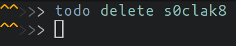

# ToDo
Simple software for creating todo lists. It uses one-file database (PersyDB) to store todos persistantly.

## Usage

### Subcommands

- `todo list`
 

- `todo add`
 

- `todo do / undo`
 
 

- `todo delete`
 

### Configuration

For now, the only thing that can be configured is persydb path. By default it will try to default to `~/.config/todo/`. To change this behaviour you can set `TODO_CONFIG` env variable and point it to your desired path.
